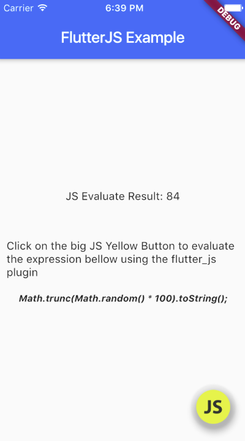
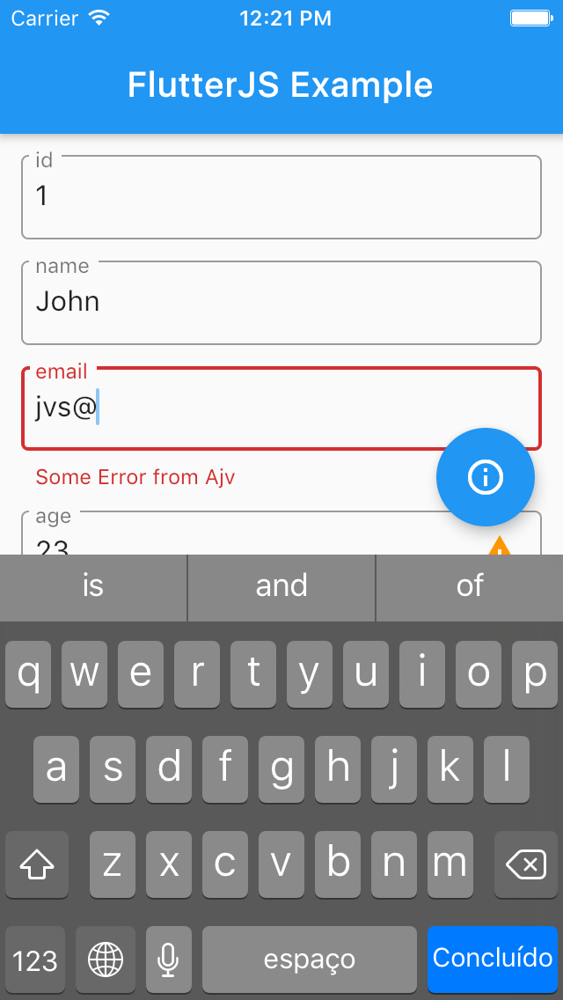
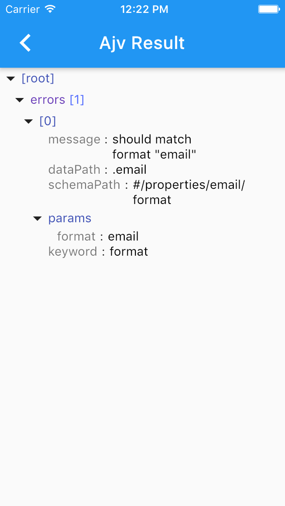
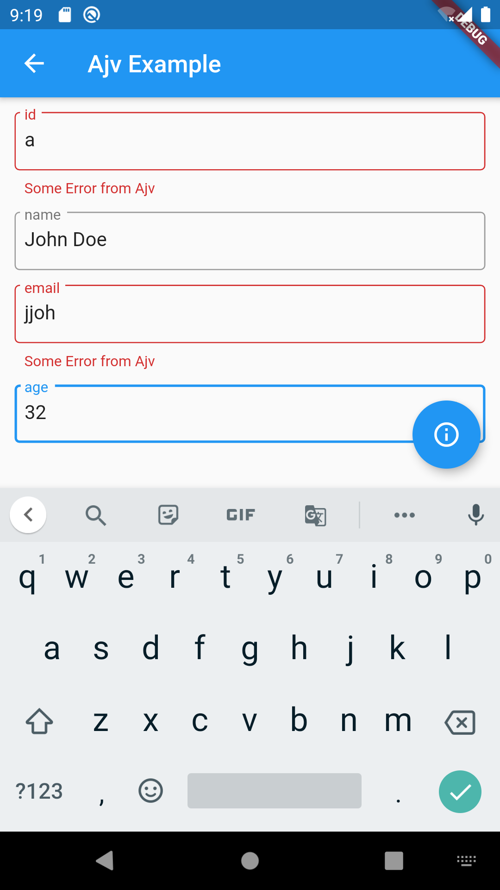
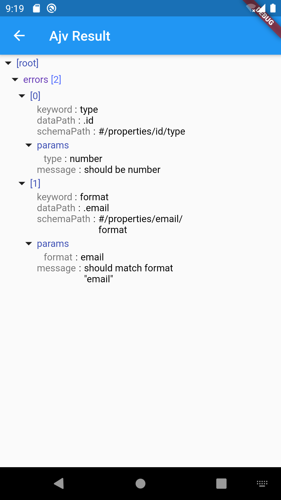

# Flutter JS plugin

A Javascript engine to use with flutter. It uses quickjs on Android and JavascriptCore on IOS


In this very early stage version we only get the result of evaluated expressions as String.

But it is good enough to take advantage of great javascript libraries such as ajv (json schema validation), moment (DateTime parser and operations) in Flutter applications running on mobile devices, both Android and iOS.

On IOS this library relies on the native JavascriptCore provided by iOS SDK. In Android it uses the amazing and small Javascript Engine QuickJS [https://bellard.org/quickjs/](https://bellard.org/quickjs/) (A spetacular work of the Fabrice Bellard and Charlie Gordon). 
It was ported to be used in Android through jni in this project i recently found on Github: [https://github.com/seven332/quickjs-android](https://github.com/seven332/quickjs-android). 
We used seven332/quickjs-android in the very first versions of flutter_js. Thanks to [seven332](https://github.com/seven332)

Recently we found the [oasis-jsbridge-android](https://github.com/p7s1digital/oasis-jsbridge-android) repository which brings quickjs integration to Android to a new level (Close to what JavascriptCore offers in iOS). So,
since version 0.0.2+1 we are using oasis-jsbridge-android quickjs library as our javascript engine under the hood. So thanks to the guys of [p7s1digital](https://github.com/p7s1digital/) team to theirs
amazing work.  





## Features:

## Instalation

### iOS

Since flutter_js uses the native JavascriptCore, no action is needed.

### Android

Change the minimum Android sdk version to 18 (or higher) in your `android/app/build.gradle` file.

```
minSdkVersion 18
```


## Example

Here is a small flutter app showing how to evaluate javascript code inside a flutter app


```dart
import 'package:flutter/material.dart';
import 'dart:async';

import 'package:flutter/services.dart';
import 'package:flutter_js/flutter_js.dart';

void main() => runApp(MyApp());

class MyApp extends StatefulWidget {
  @override
  _MyAppState createState() => _MyAppState();
}

class _MyAppState extends State<MyApp> {
  String _jsResult = '';
  int _idJsEngine = -1;
  @override
  void initState() {
    super.initState();
    initJsEngine();
  }

  // Platform messages are asynchronous, so we initialize in an async method.
  Future<void> initJsEngine() async {
  

    try {
      _idJsEngine = await FlutterJs.initEngine();
    } on PlatformException catch (e) {
      print('Failed to init js engine: ${e.details}');
    }

    // If the widget was removed from the tree while the asynchronous platform
    // message was in flight, we want to discard the reply rather than calling
    // setState to update our non-existent appearance.
    if (!mounted) return;


  }

  @override
  Widget build(BuildContext context) {
    return MaterialApp(
      home: Scaffold(
        appBar: AppBar(
          title: const Text('FlutterJS Example'),
        ),
        body: Center(
          child: Column(
            mainAxisAlignment: MainAxisAlignment.center,
            children: <Widget>[
              Text('JS Evaluate Result: $_jsResult\n'),
              SizedBox(height: 20,),
              Padding(padding: EdgeInsets.all(10), child: Text('Click on the big JS Yellow Button to evaluate the expression bellow using the flutter_js plugin'),),
              Padding(
                padding: const EdgeInsets.all(8.0),
                child: Text("Math.trunc(Math.random() * 100).toString();", style: TextStyle(fontSize: 12, fontStyle: FontStyle.italic, fontWeight: FontWeight.bold),),
              )
            ],
          ),
        ),
        floatingActionButton: FloatingActionButton(
          backgroundColor: Colors.transparent, 
          child: Image.asset('assets/js.ico'),
          onPressed: () async {
            try {
              String result = await FlutterJs.evaluate(
                  "Math.trunc(Math.random() * 100).toString();", _idJsEngine);
              setState(() {
                _jsResult = result;
              });
            } on PlatformException catch (e) {
              print('ERRO: ${e.details}');
            }
          },
        ),
      ),
    );
  }
}

```


## Alternatives

There were another packages which provides alternatives to evaluate javascript in flutter projects:

### https://pub.dev/packages/flutter_liquidcore

Good, is based on https://github.com/LiquidPlayer/LiquidCore

It is based on V8 engine so the exectuable library is huge (20Mb). So the final app will be huge too.


### https://pub.dev/packages/interactive_webview

Allows to evaluate javascript in a hidden webview. Does not add weight to size of the app, but a webview means a entire browser is in memory just to evaluate javascript code. So we think an embeddable engine is a way better solution.

### https://pub.dev/packages/jsengine

Based on jerryscript which is slower than quickjs. The jsengine package does not have implementation to iOS.


## Small Apk size

A hello world flutter app, according flutter docs has 4.2 Mb or 4.6 Mb in size.

https://flutter.dev/docs/perf/app-size#android


Bellow you can see the apk sizes of the `example app` generated with *flutter_js*:

```bash

|master ✓| → flutter build apk --split-per-abi

✓ Built build/app/outputs/apk/release/app-armeabi-v7a-release.apk (5.4MB).
✓ Built build/app/outputs/apk/release/app-arm64-v8a-release.apk (5.9MB).
✓ Built build/app/outputs/apk/release/app-x86_64-release.apk (6.1MB).
```


## Ajv

We just added an example of use of the amazing js library [Ajv](https://ajv.js.org/) which allow to bring state of the art json schema validation features
to the Flutter world.


See bellow the screens we added to the example app:

### IOS





### Android






